# 자바심화(스프링) - 과제 평가

### 프로젝트 개요

전형적인 회사 홈페이지 프론트 및 백엔드 프로젝트이다.

### 프로젝트 개발 환경

1. 인텔리제이 아이디어
2. MySQL 8.x.xx
3. JDK 17

### 홈페이지 기능

**(아래 기재되지 않는 페이지 및 기능을 구현하지 않습니다.)**

1. 로그인/회원가입 기능
2. 아이디/비번 찾기
3. 커뮤니티 - 공지사항만 제공
4. 고객지원 - 1:1 문의/묻고답하기
5. 관리자 페이지 제공 - [localhost:8080/admin](http://localhost:8080/admin)에서 admin/1234 로 로그인
6. 회원 관리
7. 공지사항 관리
    

### 작업 안해도 되는 화면과 기능들

1. 1:1문의 상세보기,  묻고 답하기 글 작성은 구현하지 않아도 됩니다.
2. 관리자페이지의 1 2 3으로 표현된 페이지 이동(네비게이션)은 구현하지 않습니다.

### 훈련생에게 제공되는 파일

- 프론트엔드 html/css/javacript/이미지파일 등 정적 웹사이트 파일 (아래 링크를 클릭하면 다운로드 가능함)

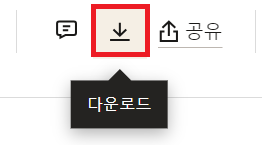

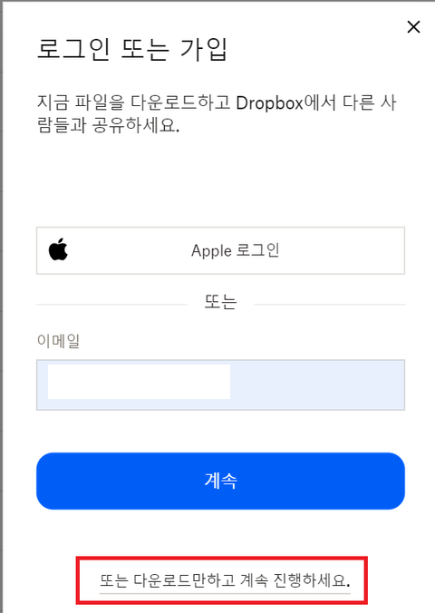

- DBMS 스키마 SQL 파일
    - DB SQL 파일(MySQL8 버전) : 화살표를 클릭하면 소스가 보임. SQL문을 사용하여 미리 MySQL 데이터베이스와 테이블을 설정한 후 과제를 수행해야 합니다.
        
        ```sql
        -- 회사홈피 db 만들기
        -- 회원가입, 로그인, 로그아웃, 아이디 찾기, 
        -- 비밀번호 찾기, 아이디 중복확인
        
        CREATE DATABASE IF NOT EXISTS testdb;
        
        USE testdb;
        
        drop table if exists company_member;
        -- member_email_receive	0: 비수신 1: 수신
        create table company_member(
            member_idx       int PRIMARY KEY AUTO_INCREMENT,
            member_id      varchar(20),
            member_pw     varchar(20),
            member_name   varchar(20),
            member_email   varchar(100),
            member_email_receive   int,
            member_pw_question   int,
            member_pw_answer   varchar(100),
            member_gender   varchar(10),
            member_birth_date      date,
            member_join_date      date DEFAULT (current_date)
        );
        DESC company_member;
        
        insert into company_member(member_idx, member_id, member_pw, member_name, member_email, member_email_receive, member_pw_question, member_pw_answer, member_gender, member_birth_date, member_join_date)
        values (0, 'hong', '1234', '홍길동', 'test@gmail.com', 0,0,0,'male','2000/01/01', now());
        
        select * from company_member;
        
        -- 관리자 회원테이블
        drop table if exists company_member_admin;
        -- member_email_receive	0: 비수신 1: 수신
        create table company_member_admin(
            member_idx       int PRIMARY KEY AUTO_INCREMENT,
            member_id      varchar(20),
            member_pw     varchar(20),
            member_name   varchar(20),
            member_email   varchar(100),
            member_join_date      date DEFAULT (current_date)
        );
        
        DESC company_member_admin;
        
        insert into company_member_admin
        values (0, 'admin', '1234', '관리자', 'admin@gmail.com', now());
        
        select * from company_member_admin;
        
        SELECT COUNT(*) FROM company_member_admin WHERE member_id = 'admin' AND member_pw = '1234';
        
        commit;
        -- 공지사항,홍보자료,채용정보, FAQ(자주묻는질문)
        -- 1:1문의, 묻고답하기(비밀글),
        
        drop table if exists company_notice;
        create table company_notice(
            notice_idx      int PRIMARY KEY AUTO_INCREMENT,
            notice_title    varchar(100),
            notice_content  varchar(2000),
            notice_member_id     varchar(20),
            notice_date     date DEFAULT (current_date)
        );
        
        insert into company_notice(notice_idx, notice_title, notice_content, notice_member_id, notice_date)
           values ( 0, '타이틀1', '내용입니다.1', 'admin', now()  );
        insert into company_notice(notice_idx, notice_title, notice_content, notice_member_id, notice_date)
           values ( 0, '타이틀1', '내용입니다.1', 'admin', DATE_ADD(NOW(), INTERVAL 1 DAY)  );
        insert into company_notice(notice_idx, notice_title, notice_content, notice_member_id, notice_date)
           values ( 0, '타이틀1', '내용입니다.1', 'admin', DATE_ADD(NOW(), INTERVAL 2 DAY)  );  
          
        select * from company_notice;
        
        commit;
        
        -- 홍보자료(뉴스)
        drop table company_news;
        create table company_news(
            news_idx      int PRIMARY KEY AUTO_INCREMENT,
            news_title    varchar(100),
            news_content  varchar(2000),
            news_member_id     varchar(20),
            news_date     date DEFAULT (current_date)
        );
        
        insert into company_news
           values ( 0, '뉴스제목1', '뉴스내용입니다.1', 'admin', now()  );
        
        SELECT * FROM company_news;
        
        -- 채용정보
        drop table if exists company_job;
        create table company_job(
            job_idx     int PRIMARY KEY AUTO_INCREMENT,
            job_title    varchar(100),
            job_content  varchar(2000),
            job_member_id     varchar(20),
            job_date     date DEFAULT (current_date)
        );
        
        insert into company_job
           values ( 0, '채용정보제목1', '채용정보내용입니다.1', 'admin', now()  );
        
        SELECT * FROM company_job;
        
        commit;
        
        -- FAQ
        drop table if exists company_faq;
        create table company_faq(
            faq_idx      int PRIMARY KEY AUTO_INCREMENT,
            faq_title    varchar(100),
            faq_content  varchar(2000)
        );
        
        insert into company_faq values
        		(0,'제목1','내용1');
        
        select * from company_faq;
        
        commit;
        
        SELECT VERSION() 
        
        -- 1:1문의
        drop table if exists company_one2one;
        create table company_one2one(
            one2one_idx     int PRIMARY KEY AUTO_INCREMENT,
            one2one_name     varchar(20), -- 고객이름
            one2one_phone    varchar(20),
            one2one_email     varchar(100),
            one2one_address   varchar(200),
            one2one_title    varchar(100),
            one2one_content  varchar(2000),
            one2one_date     date DEFAULT (current_date)
        );
        
        insert into company_one2one values
        		(0,'홍길동','010-1111-2222','hong@gmail.com','한양','제목1','내용1', now());
        
        select * from company_one2one;
        
        commit;
        
        -- 1:1문의 답글
        
        drop table if exists company_one2one_reply;
        create table company_one2one_reply(
            one2one_reply_idx      int PRIMARY KEY AUTO_INCREMENT,
            one2one_reply_content  varchar(2000),
            one2one_reply_name     varchar(20), -- 답글단사람
            one2one_reply_date     date DEFAULT (current_date),
            one2one_reply_one2one_idx      int -- 문의글의 인덱스
        );
        
        insert into company_one2one_reply values
        		(0,'1:1문의답글내용','admin', now(), 1);
        
        select * from company_one2one_reply;
        
        commit;
        
        -- 묻고답하기(비밀글)
        drop table if exists company_qna;
        create table company_qna(
            qna_idx      int PRIMARY KEY AUTO_INCREMENT,
            qna_name     varchar(20),
            qna_pw       varchar(20),
            qna_title    varchar(100),
            qna_content  varchar(2000),
            qna_date     date DEFAULT (current_date)
        );
        
        insert into company_qna values
        		(0,'홍길동','1234','제목1','내용1', now());
        
        select * from company_qna;
        
        commit;
        
        -- 묻고답하기(비밀글) 답글
        
        drop table if exists company_qna_reply;
        create table company_qna_reply(
            qna_reply_idx      int PRIMARY KEY AUTO_INCREMENT,
            qna_reply_content  varchar(2000),
            qna_reply_name     varchar(20), -- 답글단사람
            qna_reply_date     date DEFAULT (current_date),
            qna_reply_qna_idx  int -- 문의글의 인덱스
        );
        
        insert into company_qna_reply values
        		(0,'QNA문의 답글내용','admin', now(), 1);
        
        select * from company_qna_reply;
        
        commit;
        
        -- 제품목록
        drop table if exists company_product;
        create table company_product(
            product_idx      int PRIMARY KEY AUTO_INCREMENT,
            product_name     varchar(20),
            product_content  varchar(2000),
            product_img      varchar(100),
            product_reg_name     varchar(20),
            product_date     date DEFAULT (current_date)
        );
        
        insert into company_product values
        		(0,'제품이름1','제품설명1','/img/product/1.jpg','admin',now());
        
        select * from company_product;
        
        commit;
        ```

### 제출 파일

1. **src 폴더의 main 폴더만** 압축하여 학습사이트(alpacocampus.com)에 제출합니다.
2. 슬랙 DM으로 강사에게 **전체 프로젝트 압축한 파일**을 전송합니다.
3. 슬랙 DM으로 강사에게 아래 채점가이드 대로 **모든 채점가이드 테스트 케이스에 따라 테스트한 화면녹화 영상**을 전송합니다.

# 채점가이드

- **기본점수 50점에서 추가로 아래 득점요소를 반영합니다.**
- **다른 훈련생의 제출한 파일(소스)과 유사도가 90%이하가 되도록 해주세요.(소스 전달 금지, 90%이상 유사시 감점 처리됩니다.)**
- 세부 HTML UI는 제공한 html/css/js 및 동작 동영상과 일치 하지 않아도 됩니다. 다만 채점 가이드에 맞게만 동작하면 됩니다.
- **아래 채점가이드 외의 세부점수는 추가로 드릴 수 없습니다.**
- **오픈북, 오픈PC 과제형 평가이므로, 강의시간에 강의한 내용에 없거나 교안에 없는 내용이라도 채점기준에 부합하면 득점하게 됩니다.**

### 제출 기한

- 4월 22일(월) 정오(낮) 12:00까지 제출(기한후 제출시 **-5점 감점**)

### 제출파일

1. **모든 채점가이드 테스트 케이스에 따라 테스트한 화면녹화 영상**을 슬랙DM을 제출합니다.

(테스트 동영상 미제출 또는 일부제출시 **-3점 감점**)

### DB설정

1. 제공한 SQL의  database이름: testdb를 이용해야 한다. **득점 1점**
2. 제공한 SQL의 create table을 이용한 문장을 이용하여 테이블을 생성해야 한다. **득점 2점**
    
     - 테이블을 제시한 SQL과 다르게 설정한다면 채점을 위한 테스트를 하기가 어렵습니다. 
    
    (이때는 사용한 SQL파일을 강사에게 별도로 제공해 주어야 합니다.) 
    
    -  그외 데이타 insert문은 table구조에 맞게 넣어서 사용하면 됩니다. 
    
    (관리자 페이지에서 10개씩 보기 등의 기능을 구현해야 한다면, 10개이상을 넣습니다.)
    

### 회원가입

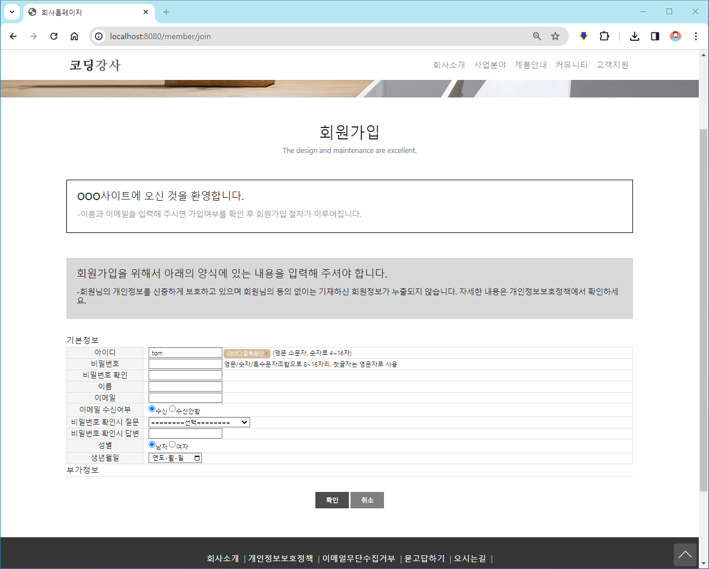

- 유효성 확인 후 **사용자 알림**은 JS Alert창 또는 HTML안에 내용(innertText, innerHTML)으로 입력합니다. 이 둘 중 하나만 사용하면 됩니다.
1. 아이디,비번,비번확인 등 모든 입력정보는 필수입니다.  “아이디가 입력되지 않았습니다” **사용자 알림**을 띄워 모든 정보가 필수적으로 입력되도록 합니다. (단 프론트엔드에서 기본값으로 설정된 경우는 그 기본값을 사용하면 됩니다.) **득점 1점**
2. 아이디중복확인 버튼 클릭시, ajax통신으로 서버에 있는 회원테이블에 중복된 아이디가 있는지 확인후 **사용자 알림**을 통해 “아이디 사용가능합니다” 또는 “아이디가 중복됩니다” **사용자 알림**을 띄웁니다.  (제공동영상 확인) **득점 3점**
3. 비번은 4자리 이상만 입력가능하도록  합니다.
    
    (유효성 체크는 프론트엔드 JS안에서 가능하도록 합니다.)
    
    확인버튼 클릭시 유효성 체크후에 유효한 비번이 아니다면, “4자리이상만 가능합니다.”라고**사용자 알림**을 띄웁니다. 화면이동이나 서버측에 submit이 되지 않도록 합니다. **득점 1점**
    
4. 비번과 비번확인이 서로 다르다면 확인버튼 클릭시 “암호가 일치하지 않습니다. 다시 입력해주세요” 유효성 확인 **사용자 알림**을 띄웁니다. (유효성 체크는 프론트엔드 JS안에서 가능하도록 합니다.) **득점 1점**

### 로그인

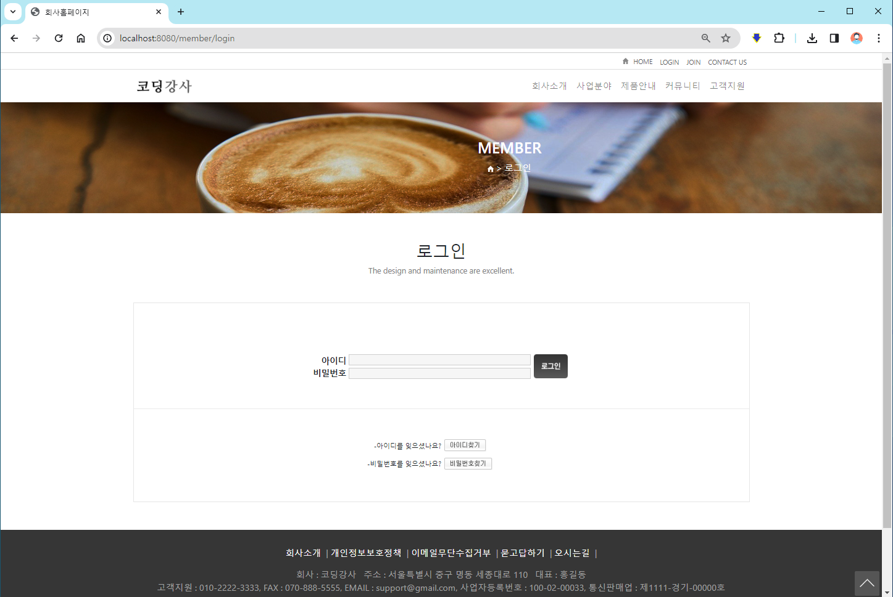

- 유효성 확인 후 **사용자 알림**은 JS Alert창 또는 HTML안에 내용(innertText, innerHTML)으로 입력합니다. 이 둘 중 하나만 사용하면 됩니다.
1. 새로 가입한 회원 아이디와 비번으로 로그인이 가능하도록 로그인 로직을 서버에 개발합니다. **득점 1점**
2. 아이디가 존재하지 않는다면 “아이디가 존재하지 않습니다.”, 비번이 틀리다면 “비밀번호가 다릅니다.”라고 **사용자 알림**을 띄웁니다. 각각 득점 1점 **총 2점**
3. 로그인 성공후 “로그인되었습니다.” **사용자 알림**을 띄운후 홈화면으로 이동합니다. **득점 1점**
4. 로그인한 사용자만 고객지원 - 1:1문의, 묻고답하기, FAQ화면에 접근하도록 허용합니다. 로그인을 안한 사용자가 접근시 “로그인을 해주세요” **사용자 알림**을 띄운후 로그인화면으로 이동합니다. **득점 1점**

### 아이디 찾기(팝업페이지가 아닌 본문 페이지 이동으로 구현해도 됩니다.)

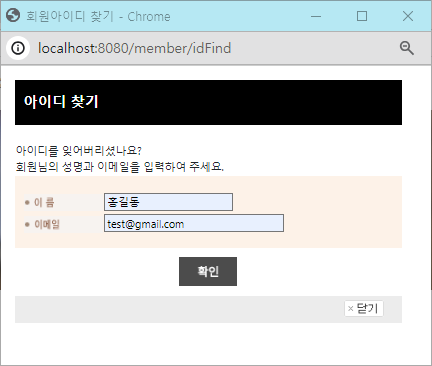

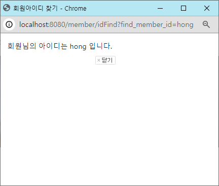

1. 이름과 이메일을 입력하며, 아이디를 서버로부터 검색하여 html에 출력합니다. **득점 2점**
2. 팝업된 창에서 정보를 확인하고 그냥 닫습니다. 원래화면(부모창)과의 통신은 따로 없습니다.

### 비번 찾기(팝업페이지가 아닌 본문 페이지 이동으로 구현해도 됩니다.)

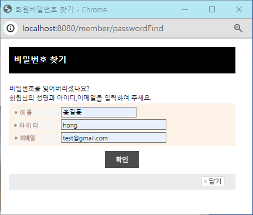

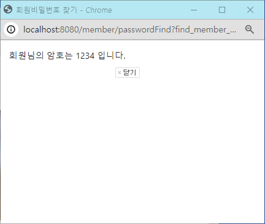

1. 이름, 아이디, 이메일을 입력하며, 비번을 서버로부터 검색하여 html에 출력합니다. **득점 2점**
2. 팝업된 창에서 정보를 확인하고 그냥 닫습니다. 원래화면(부모창)과의 통신은 따로 없습니다.

### 공지사항

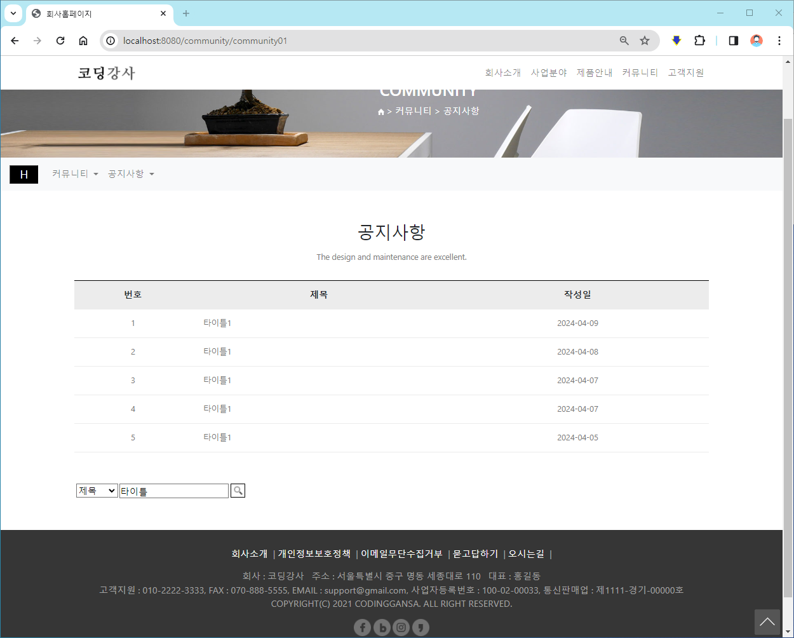

1. 커뮤니티 - 공지사항을 클릭하면 서버 테이블에 있는 공지사항 리스트를 화면과 같이 출력합니다. **득점 2점**
2. 제목/내용~~/작성자~~ 중 하나를 선택하고 검색어를 입력한후 돋보기(검색)아이콘을 클릭하면, 검색된 목록이 출력되게 합니다. 제목/내용~~/작성자~~ 두가지 검색만 가능하면 됩니다. **득점 2점**
    
    예) 제목 “타이틀”이라고 검색하면 제목 컬럼(열)에 “타이틀” 문구를 포함하는 모든 레코드(공지사항)을 가져와서 출력합니다. 
    


c. 공지사항 목록에서 번호나 타이틀이나 작성일 중 하나를 클릭하면 공지사항 상세 페이지로 이동합니다. URL 예) [http://localhost:8080/community/community01_1?notice_idx=5](http://localhost:8080/community/community01_1?notice_idx=5)

화면과 같이 제목, 작성일, 내용을 출력합니다.  **득점 1점**

### 1:1 문의

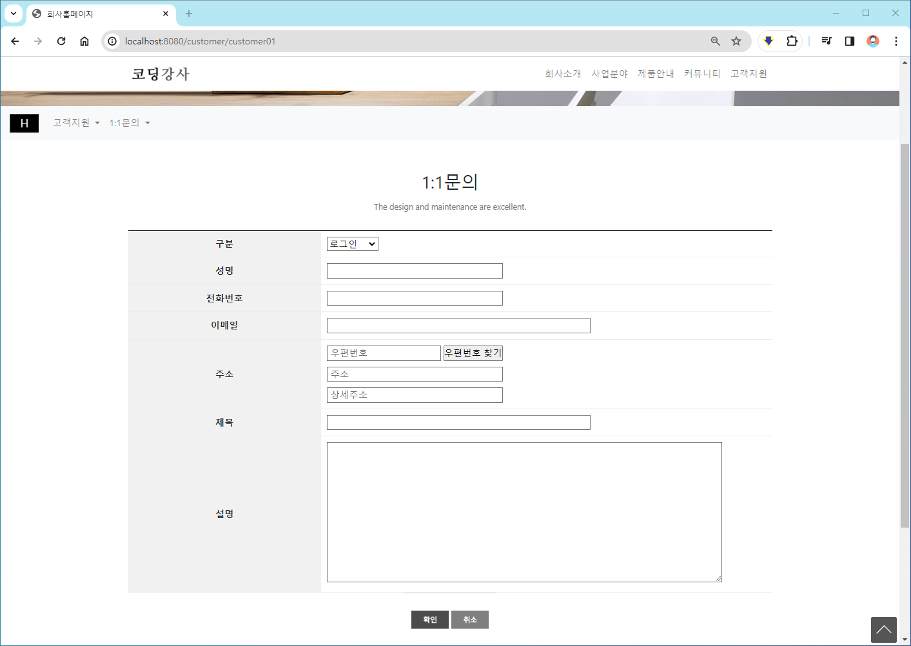

1. 입력데이터중 구분은 따로 DB에 저장하지 않습니다.
2. 나머지 성명, 전화번호, 이메일, 주소(주소 + 상세주소)(우편번호는 저장하지 않습니다.), 제목, 설명, 현재날짜 등을 DB에 저장합니다. **득점 2점** 
3. 저장된 DB데이터는 관리자 화면에서 확인 가능합니다.

### 묻고답하기

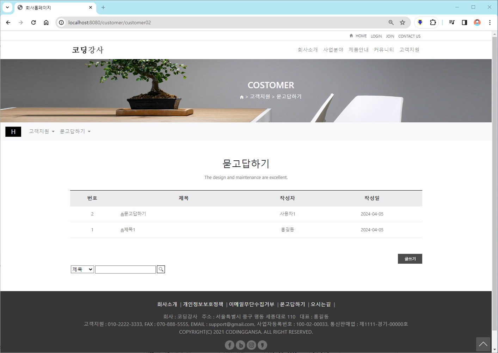

1. 묻고 답하기 목록을 DB데이터를 가져와 출력합니다. **득점 1점**
2. 제목/내용/작성자 기준으로 검색어를 넣고 검색버튼을 누르면 해당하는 목록만 출력합니다. (검색은 SQL LIKE구문을 통해 해당 검색어가 들어가는 조건으로 검색합니다.) **득점 1점**
3. 묻고답하기 목록에서 번호/제목/작성자/작성일을 누르면 비번입력창으로 이동합니다. 아래 화면 참조.
4. 비밀번호입력 창에서 글작성시 입력한 비번을 입력할때만 상세화면으로 이동합니다. **득점 2점**
    
    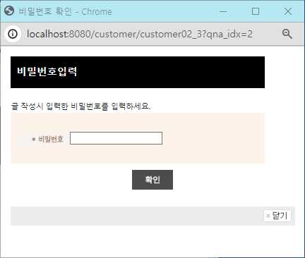
    
5. 묻고답하기 상세 화면에서 상세 정보를 출력합니다. (상단의 이미지 링크가 깨진 것은 무시합니다) **득점 1점**

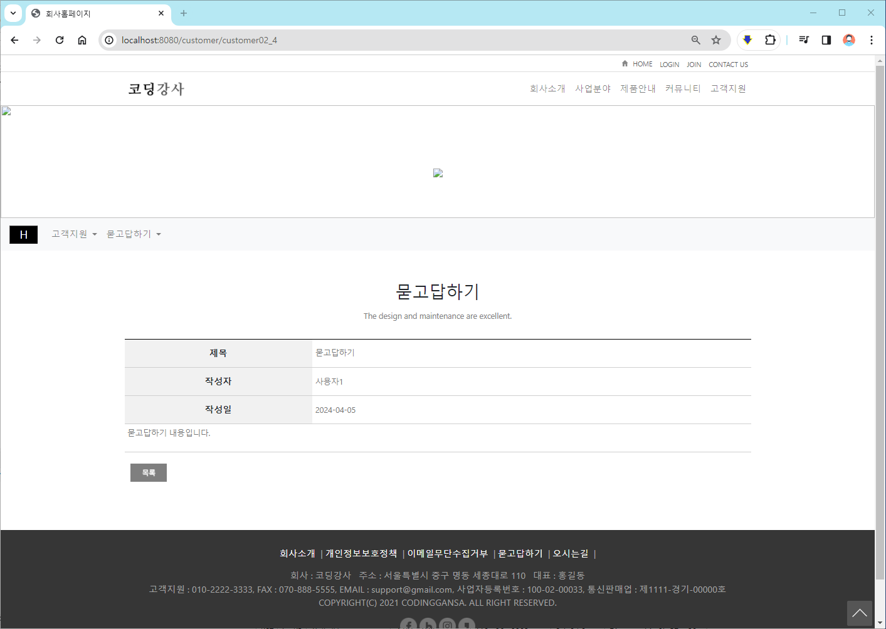

# 관리자페이지

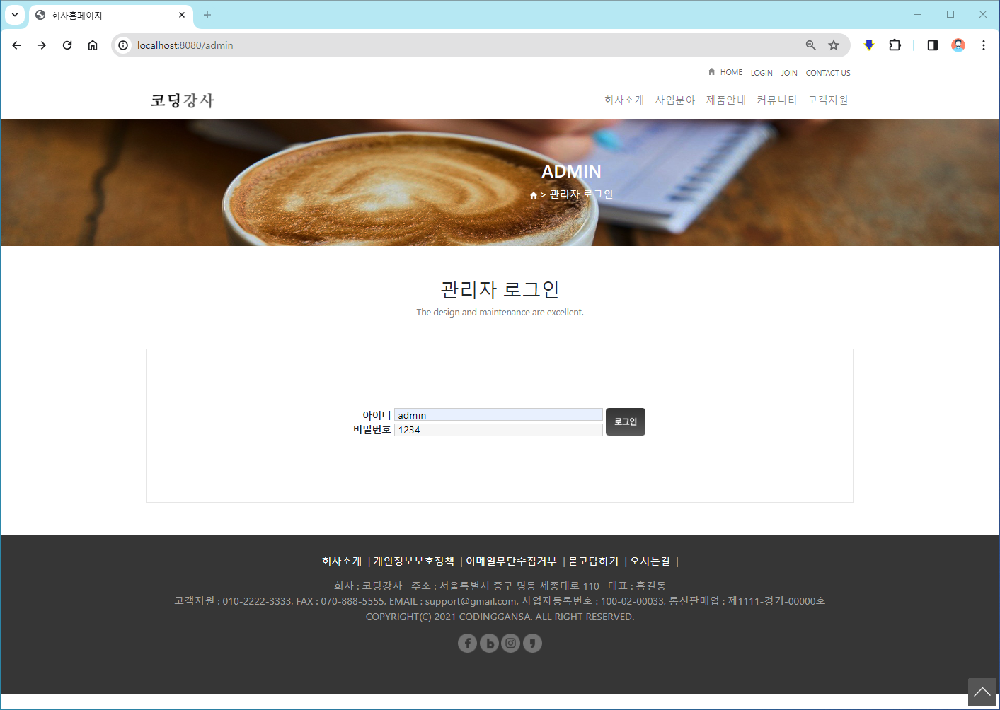

 a. [http://localhost:8080/admin](http://localhost:8080/admin) 로 이동하여,  admin/1234로 로그인합니다.(별도 링크는 없고, 웹브라우저 주소창에 직접 입력하여 이동합니다.)

### 회원관리

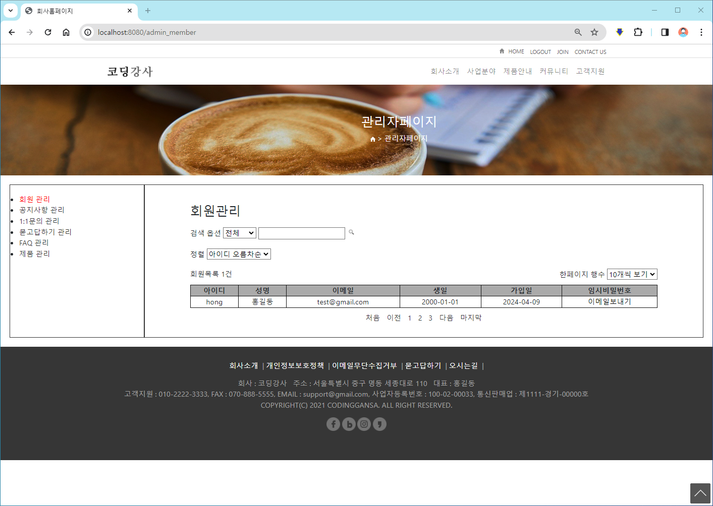

1. 회원목록 N건과 목록(아이디/성명/이메일/생일/가입일)을 출력합니다. **득점 1점** (임시비번-이메일보내기 기능은 구현하지 않고 무시합니다.)
2. 전체/아이디/성명/이메일/~~핸드폰~~/주소 검색옵션과 검색어로 검색 기능을 구현합니다.
    - 전체는 아이디/성명/이메일/~~핸드폰/~~주소 중에서 검색어를 포함하고 있으면 목록에 출력합니다.(핸드폰은 포함하지 않고, 영문 대소문자 구분하지 않습니다.) **득점 2점**
    - 핸드폰은 회원가입 목록에 없으므로 구현하지 않습니다.
    - 아이디/성명/이메일/주소는 검색어를 포함하고 있으면 목록에 출력합니다. **득점 2점**
3. 정렬 - 아이디 오름차순/내림차순, 가입일 오름차순/내림차순 정렬기능을 구현합니다. select태그의 onchanage 이벤트를 사용하여 검색합니다. **득점 1점**
4. 5개만 보기, 10개만 보기, 전체 보기로 구현합니다. select태그의 onchanage 이벤트를 사용하여 검색합니다. **득점 1점** 

### 공지사항관리

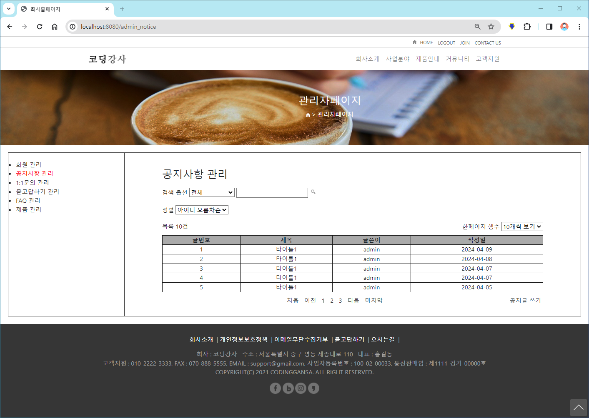

1. 목록 N건과 목록(글번호/제목/글쓴이/작성일)을 출력합니다. **득점 1점** 
2. 전체/제목/내용/작성자아이디 검색옵션과 검색어로 검색 기능을 구현합니다.
    - 전체는 제목/내용/작성자아이디 중에서 검색어를 포함하고 있으면 목록에 출력합니다.(영문 대소문자 구분하지 않습니다.) **득점 1점**
    - 제목/내용/작성자아이디는 검색어를 포함하고 있으면 목록에 출력합니다. **득점 1점**
3. 정렬 - 아이디 오름차순/내림차순, 가입일 오름차순/내림차순 정렬기능을 구현합니다. select태그의 onchanage 이벤트를 사용하여 검색합니다. **득점 1점**
4. 5개만 보기, 10개만 보기, 전체 보기로 구현합니다. select태그의 onchanage 이벤트를 사용하여 검색합니다. **득점 1점**
5. 처음 이전 123 다음 마지막 - 페이지 네비게이션을 **구현하지 않습니다.**
6. 공지글쓰기 링크를 클릭하면 공지사항 글을 등록할 수 있습니다.

### 공지사항 쓰기

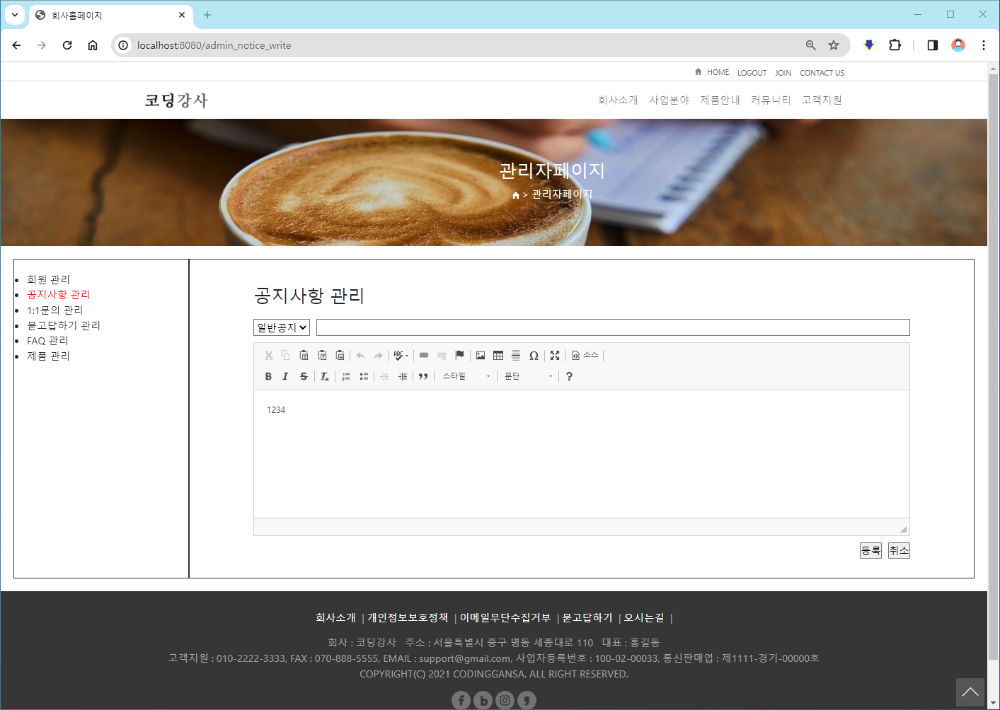

1. 일반공지/중요공지 옵션은 무시합니다.
2. 제목과 내용, 작성일, 작성자아이디를 DB에 등록합니다. **득점 2점**
3. ckeditor4로 HTML Editor로 UI가 구성되어 있지만, ckeditor4를 제거하고 input태그 type=”text”로 구현해도 되고, textarea태그 내용으로 form태그를 사용하여 구현해도 됩니다. 서버에 전송하여 데이터만 입력되면 됩니다.

sql참조

```sql
create table company_notice(
    notice_idx      int PRIMARY KEY AUTO_INCREMENT,
    notice_title    varchar(100),
    notice_content  varchar(2000),
    notice_member_id     varchar(20),
    notice_date     date DEFAULT (current_date)
);
```

### 공지사항 수정


1. 공지사항 목록에서 글번호/제목/글쓴이/작성일 중 하나를 클릭하면 공지사항 수정 화면으로 이동할 수 있게 합니다. **득점 1점**
2. 공지사항 내용만 수정하여 수정버튼을 클릭시 DB에 수정이 이루어지도록 합니다. **득점 2점**
3. ckeditor4로 HTML Editor로 UI가 구성되어 있지만, ckeditor4를 제거하고 input태그 type=”text”로 구현해도 되고, textarea태그 내용으로 form태그를 사용하여 구현해도 됩니다. 서버에 전송하여 데이터만 입력되면 됩니다.

- 1:1문의관리/묻고답하기 관리/FAQ 관리/제품 관리 화면은 구현하지 않습니다.
